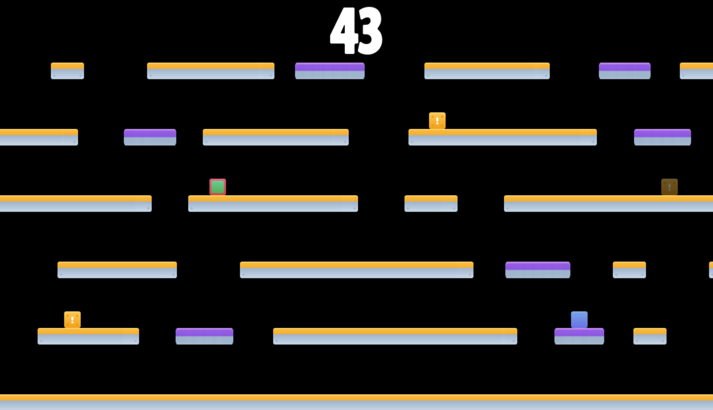

# TAG!!!

This is a two player game with the objective of not being *it* before the time runs out!

## How to Play

### Select Difficulty:

You can select between Novice and Pro game difficulties via the start menu. 
- The **Novice** difficulty involves only static platforms.
- The **Pro** difficulty involves static AND moving platforms.

### Movement:

The *green* player controls with the WAD keys to move up, left, and right respectively. The *blue* player controls with
the arrow keys. 

### Game Mechanics:

The player that is *it* is marked by with a red perimeter:

If you are *it* you will notice you have a **significant** speed and jump advantage over the runner. 

As such, the goal of the runner to collect powerups which spawn **randomly** throughout the map:

Powerups give speed and jump bonuses that even **trump** that of the *it* player! 

Pro Tip: try jumping along the sides of platforms :blush:
